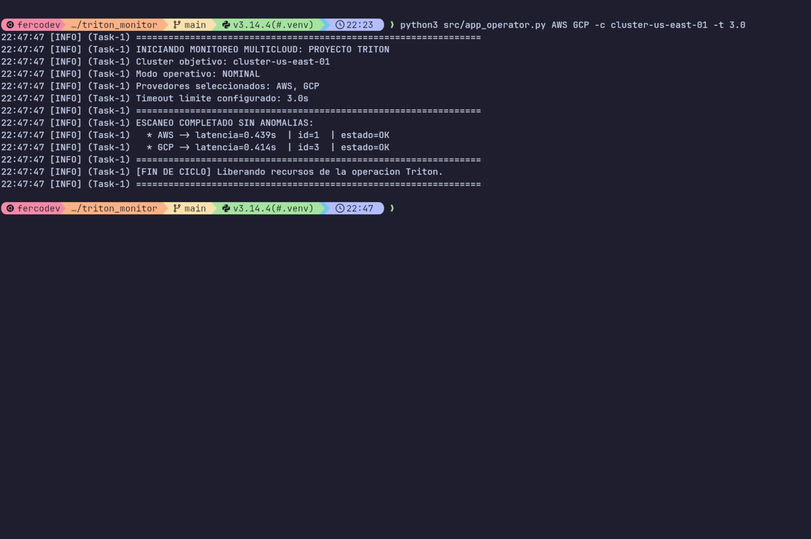
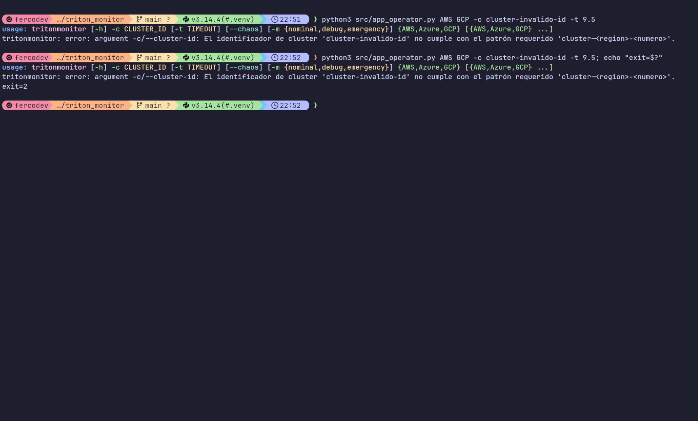
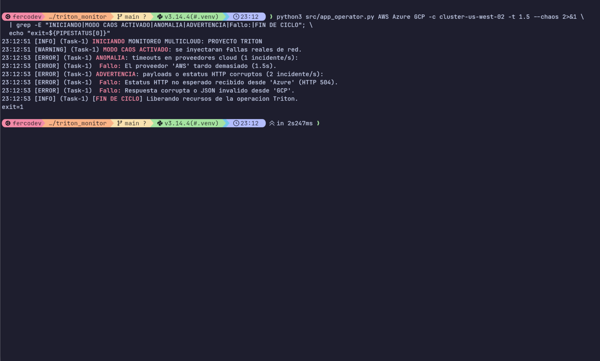
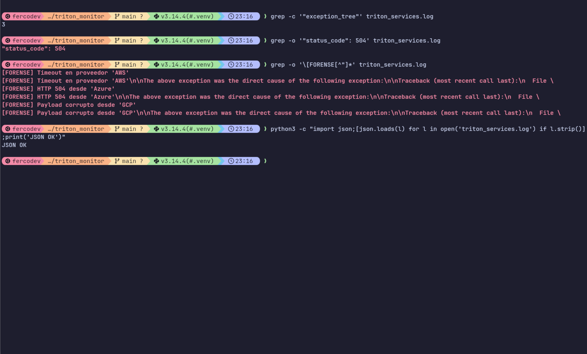
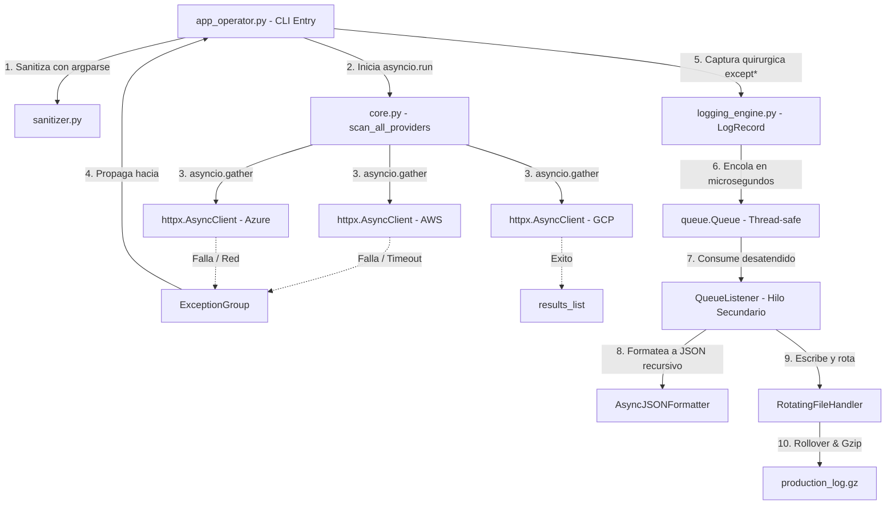

# Proyecto Triton - Telemetria Multicloud

## Grupo: Runtime Error 💀

## Integrantes

| Nombre                     |
| -------------------------- |
| Alegre, Facundo Sebastian  |
| Gaspar, Lautaro            |
| Herrera, Nancy Mariel      |
| Mamani, Hector Mauricio    |
| Rodriguez, Hector Fernando |
| Maldonado, Fernando        |

## Roles del Proyecto

| #   | Rol                                            | Archivo(s)                        | Integrante                 |
| --- | ---------------------------------------------- | --------------------------------- | -------------------------- |
| 1   | Robustez de Entradas y Excepciones             | `exceptions.py` + `sanitizer.py`  | Herrera, Nancy Mariel      |
| 2   | Concurrencia y Telemetria Asincrona            | `core.py`                         | Maldonado, Fernando        |
| 3   | Formateo Estructurado JSON                     | `logging_engine.py` (formatter)   | Mamani, Hector Mauricio    |
| 4   | Almacenamiento y Desacoplamiento No Bloqueante | `logging_engine.py` (pipeline)    | Alegre, Facundo Sebastian  |
| 5   | Integracion y Flujo CLI                        | `app_operator.py` + `__init__.py` | Rodriguez, Hector Fernando |
| 6   | Simulacion de Caos y Pruebas Forenses          | `tests/`                          | Gaspar, Lautaro            |

## Requisitos

- Python 3.11+
- httpx>=0.27.0

## Instalacion

Se recomienda un entorno virtual para aislar las dependencias del proyecto (httpx):

```bash
git clone https://github.com/Ferco7/triton_monitor.git
cd triton_monitor
python3 -m venv .venv
source .venv/bin/activate   # Windows: .venv\Scripts\activate
pip install -r requirements.txt
```

## Ejecucion

Con el entorno activado, los escenarios oficiales de la consigna:

```bash
# Escenario A - Operacion nominal
python3 src/app_operator.py AWS GCP -c cluster-us-east-01 -t 3.0
#   Salida esperada: exit 0, escaneo completo sin anomalias.

# Escenario B - Argumentos invalidos (frontera CLI, no inicia asyncio)
python3 src/app_operator.py AWS GCP -c cluster-invalido-id -t 9.5
#   Salida esperada: exit 2, error de argparse.

# Escenario C - Inyeccion de caos (fallos concurrentes)
python3 src/app_operator.py AWS Azure GCP -c cluster-us-west-02 -t 1.5 --chaos
#   Salida esperada: exit 1, 3 anomalias (timeout, 504, payload corrupto).
```

## Evidencia de Ejecucion

Capturas reales de una corrida local. Las salidas de consola se acortaron por
legibilidad: el stack_trace completo queda serializado en `triton_services.log`.

| Escenario A - Operacion nominal         | Escenario B - Argumentos invalidos      |
| --------------------------------------- | --------------------------------------- |
|      |  |

| Escenario C - Inyeccion de caos         | Log forense JSON (arbol + gzip)         |
| --------------------------------------- | --------------------------------------- |
|            |  |

## Diagrama de Arquitectura



## Estructura del Proyecto

```
triton_monitor/
├── src/
│   ├── triton_telemetry/
│   │   ├── __init__.py          # API publica del paquete
│   │   ├── exceptions.py        # Excepciones semanticas custom
│   │   ├── sanitizer.py         # Validacion de argumentos CLI
│   │   ├── core.py              # Logica asincrona de red
│   │   └── logging_engine.py    # Formateador JSON y pipeline
│   └── app_operator.py          # Punto de entrada CLI
├── tests/
│   ├── README.md                # Instrucciones para tests
│   ├── test_scenarios.py        # Escenarios de simulacion de caos
│   └── test_forensic_validator.py  # Validador forense JSON/gzip
├── requirements.txt             # Dependencias del proyecto
├── .gitignore                   # Archivos ignorados por git
└── README.md                    # Este archivo
```

## Modulos y Diseno Clave

### exceptions.py (Rol 1)

Jerarquia semantica de errores:

- `TritonError` hereda de `Exception` (nunca de `BaseException`, para no capturar senales del sistema como Ctrl+C).
- Subclases de dominio: `ProviderTimeoutError` (timeouts de red), `CorruptedPayloadError` (payloads corruptos o estatus HTTP fallidos) y `NetworkPeeringError` (fallos de DNS o resolucion de hosts).

### sanitizer.py (Rol 1)

Validacion en la frontera CLI (sanitizadores custom de argparse):

- `parse_timeout`: restringe `--timeout` a float en el rango [0.1, 5.0]; fuera de rango lanza `argparse.ArgumentTypeError` y la CLI sale con codigo 2 sin tocar la red.
- `parse_cluster_id`: valida el cluster con la expresion regular estricta `cluster-<region>-<numero>` (ej. `cluster-us-east-01`).

### core.py (Rol 2)

Concurrencia y telemetria asincrona con httpx + asyncio:

- Corrutinas paralelas que consultan APIs reales: `jsonplaceholder` (AWS, Azure, GCP) y, en modo caos, `httpbin.org/delay/3` (timeout), `httpbin.org/status/504` (HTTP status) y `httpbin.org/xml` (payload corrupto).
- Orquestacion con `asyncio.gather(return_exceptions=True)` + `ExceptionGroup` manual: al fallar una tarea no se cancelan las restantes, garantizando la captura de todas las anomalias concurrentes (decision validada con la catedra; el fail-fast de `TaskGroup` amputaria categorias del arbol forense).
- Los fallos nativos de httpx se re-lanzan encadenados (`raise ... from`) como excepciones semanticas y con contexto forense via `add_note()`.

### logging_engine.py (Roles 3 y 4)

Formatter `AsyncJSONFormatter`:

- Serializa cada `LogRecord` a una linea JSON: timestamp ISO 8601 UTC estricto (sufijo `Z`), level, logger, message, process, threadName, async_task, filename, line.
- `exception_tree` recursivo: class, message, notes (`add_note`), cause (`__cause__`), nested_exceptions (ExceptionGroup), httpx_request/httpx_response (metodo, URL, status_code) y stack_trace textual.
- Protege el esquema raiz ante colisiones de metadatos dinamicos inyectados via `extra`.

Pipeline no bloqueante:

- `QueueHandler` + `queue.Queue` + `QueueListener`: la escritura fisica ocurre en un hilo secundario, sin bloquear el event loop de asyncio.
- `RotatingFileHandler` acotado a 2 MB con hasta 3 backups.
- Callbacks `namer`/`rotator` de gzip: el historial rotado se comprime a `.gz` y se elimina el archivo plano residual.
- `TritonQueueHandler` (subclase) preserva `exc_info` a traves de la cola, materializando el `exception_tree` en el log.

### app_operator.py (Rol 5) + __init__.py

Punto de entrada CLI:

- argparse declarativo con los sanitizadores del rol 1, `choices` de proveedores (AWS/Azure/GCP), `-c/--cluster-id`, `-t/--timeout`, `--chaos` y `-m/--mode` (nominal/debug/emergency).
- Configuracion de logging declarativa mediante `dictConfig`.
- Captura quirurgica con `except*`: timeout, payload corrupto, red/peering y error generico Triton, iterando `group.exceptions`.
- `finally` solo libera recursos (apaga el QueueListener) bajo PEP 765: sin `return`/`break`/`continue`.
- `__init__.py` expone la API publica del paquete via `__all__`.

### tests/ (Rol 6)

Suite de validacion documentada en `tests/README.md`: escenarios A/B/C del CLI (exit codes y salida) + validador forense del log JSON y de la descompresion gzip.