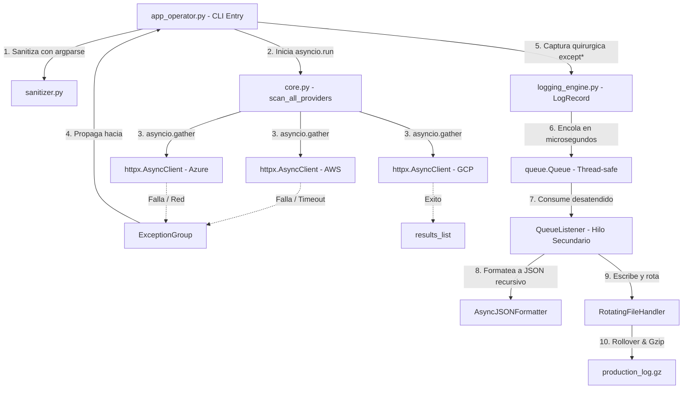

# Proyecto Triton - Telemetria Multicloud

## Grupo: Runtime Error 💀

## Integrantes

| Nombre                     |
| -------------------------- |
| Alegre, Facundo Sebastian  |
| Gaspar, Lautaro            |
| Herrera, Nancy Mariel      |
| Mamani, Hector Mauricio    |
| Rodriguez, Hector Fernando |
| Maldonado, Fernando        |

## Roles del Proyecto

| #   | Rol                                            | Archivo(s)                        | Integrante                 |
| --- | ---------------------------------------------- | --------------------------------- | -------------------------- |
| 1   | Robustez de Entradas y Excepciones             | `exceptions.py` + `sanitizer.py`  | Herrera, Nancy Mariel      |
| 2   | Concurrencia y Telemetria Asincrona            | `core.py`                         | Maldonado, Fernando        |
| 3   | Formateo Estructurado JSON                     | `logging_engine.py` (formatter)   | Mamani, Hector Mauricio    |
| 4   | Almacenamiento y Desacoplamiento No Bloqueante | `logging_engine.py` (pipeline)    | Alegre, Facundo Sebastian  |
| 5   | Integracion y Flujo CLI                        | `app_operator.py` + `__init__.py` | Rodriguez, Hector Fernando |
| 6   | Simulacion de Caos y Pruebas Forenses          | `tests/`                          | Gaspar, Lautaro            |

## Requisitos

- Python 3.11+
- httpx>=0.27.0

## Instalacion

Se recomienda un entorno virtual para aislar las dependencias del proyecto (httpx):

```bash
git clone https://github.com/Ferco7/triton_monitor.git
cd triton_monitor
python3 -m venv .venv
source .venv/bin/activate   # Windows: .venv\Scripts\activate
pip install -r requirements.txt
```

## Ejecucion

Con el entorno activado, los escenarios oficiales de la consigna:

```bash
# Escenario A - Operacion nominal
python3 src/app_operator.py AWS GCP -c cluster-us-east-01 -t 3.0
#   Salida esperada: exit 0, escaneo completo sin anomalias.

# Escenario B - Argumentos invalidos (frontera CLI, no inicia asyncio)
python3 src/app_operator.py AWS GCP -c cluster-invalido-id -t 9.5
#   Salida esperada: exit 2, error de argparse.

# Escenario C - Inyeccion de caos (fallos concurrentes)
python3 src/app_operator.py AWS Azure GCP -c cluster-us-west-02 -t 1.5 --chaos
#   Salida esperada: exit 1, 3 anomalias (timeout, 504, payload corrupto).
```

## Diagrama de Arquitectura



## Estructura del Proyecto

```
triton_monitor/
├── src/
│   ├── triton_telemetry/
│   │   ├── __init__.py          # API publica del paquete
│   │   ├── exceptions.py        # Excepciones semanticas custom
│   │   ├── sanitizer.py         # Validacion de argumentos CLI
│   │   ├── core.py              # Logica asincrona de red
│   │   └── logging_engine.py    # Formateador JSON y pipeline
│   └── app_operator.py          # Punto de entrada CLI
├── tests/
│   ├── README.md                # Instrucciones para tests
│   └── test_scenarios.py        # Escenarios de validacion
├── requirements.txt             # Dependencias del proyecto
├── .gitignore                   # Archivos ignorados por git
└── README.md                    # Este archivo
```

# AsyncJSONFormatter

`AsyncJSONFormatter` es una clase que transformar los registros nativos de Python (`logging.LogRecord`) en payloads JSON estructurados. Extrae telemetría concurrente (hilos, procesos, tareas asíncronas), desempaqueta excepciones complejas y procesa metadatos dinámicos sin riesgo de colisiones o fallos de serialización.

---

## 1. Métodos y Funciones Principales

### `_json_default(value: Any) -> str`

Es un método estático auxiliar utilizado por `json.dumps`. Se ejecuta cuando el serializador encuentra un tipo de dato que no sabe cómo procesar nativamente.

```python
    @staticmethod
    def _json_default(value: Any) -> str:
        """Convierte datetimes a ISO 8601 UTC estricto (con Z), y el resto a texto."""
        if isinstance(value, datetime):
            if value.tzinfo is None:
                dt_utc = value.replace(tzinfo=timezone.utc)
            else:
                dt_utc = value.astimezone(timezone.utc)
            return dt_utc.isoformat().replace("+00:00", "Z")
        return str(value)
```

* **Control de Datetimes (`isinstance(value, datetime)`):**

  * Si el desarrollador colocó una fecha, verifica si es *naive* (sin zona horaria, `tzinfo is None`). Si lo es, asume que es UTC y le inyecta la zona.
  * Si ya tiene zona horaria (*aware*), la convierte matemáticamente a UTC.
  * Formatea la cadena a ISO 8601 y reemplaza el sufijo `+00:00` por `Z` para cumplir con los estándares estrictos de observabilidad.

* **Control de Tipos Desconocidos (`return str(value)`):** Si el objeto es un `UUID`, un `Set` o una clase personalizada, lo convierte a texto para que la aplicación no interrumpa su ejecución con un `TypeError`.

### `_serialize_exception(self, exc: BaseException) -> Dict[str, Any]`

Método recursivo que descompone una excepción en un diccionario navegable, extrayendo más contexto que un *stacktrace* tradicional.

```python
    exc_data: Dict[str, Any] = {
        "class": exc.__class__.__name__,
        "message": str(exc),
        "notes": list(getattr(exc, "__notes__", []))
    }
```

* **Diccionario Base:** Captura la clase del error, el mensaje y cualquier nota agregada dinámicamente (`__notes__`, introducido en Python 3.11).

```python
    if exc.__class__.__module__.startswith("httpx"):
        try:
            request = getattr(exc, "request", None)
            if request:
                exc_data["httpx_request"] = {
                    "method": getattr(request, "method", None),
                    "url": str(getattr(request, "url", ""))
                }
            response = getattr(exc, "response", None)
            if response:
                exc_data["httpx_response"] = {
                    "status_code": getattr(response, "status_code", None),
                    "reason_phrase": getattr(response, "reason_phrase", None),
                    "url": str(getattr(response, "url", ""))
                }
        except RuntimeError:
            pass
```

* **Bloque de Extracción `httpx`:**

  * Identifica si la excepción proviene de `httpx` evaluando `exc.__class__.__module__`.
  * Utiliza un bloque `try/except RuntimeError` al leer `.request` y `.response`. Esto es crítico porque, en ciertos fallos de red de bajo nivel, acceder a la propiedad `.request` en `httpx` dispara un error interno que destruiría el log.
  * Extrae de forma segura el método HTTP, URLs, código de estado y la frase de motivo (*reason phrase*).

```python
    if isinstance(exc, BaseExceptionGroup):
        exc_data["nested_exceptions"] = [
            self._serialize_exception(nested_err)
            for nested_err in exc.exceptions
        ]
    if getattr(exc, "__cause__", None):
        exc_data["cause"] = self._serialize_exception(exc.__cause__)
    return exc_data
```

* **Control `ExceptionGroup` (`isinstance(exc, BaseExceptionGroup)`):** Si la excepción es un grupo (múltiples errores lanzados asíncronamente), itera sobre `exc.exceptions` y se llama a sí mismo recursivamente para anidarlas en el JSON.
* **Control de Causa Raíz (`getattr(exc, "__cause__", None)`):** Si la excepción fue provocada por otra (`raise A from B`), extrae la excepción original recursivamente.

### `format(self, record: logging.LogRecord) -> str`

El método orquestador principal que sobrescribe el comportamiento por defecto de `logging.Formatter`.

```python
    dt_utc = datetime.fromtimestamp(record.created, tz=timezone.utc)
    log_payload: Dict[str, Any] = {
        "timestamp": dt_utc.isoformat().replace("+00:00", "Z"),
        "level": record.levelname,
        "logger": record.name,
        "message": record.getMessage(),
        "process": record.process,
        "threadName": record.threadName,
        "async_task": getattr(record, "taskName", None),
        "filename": record.filename,
        "line": record.lineno
    }
```

* **Estructuración Base:** Crea `log_payload`, asignando el timestamp (calculado en UTC estricto a partir de `record.created`), nivel, mensaje y métricas de concurrencia (`process`, `threadName`, `taskName`).

```python
    if record.exc_info:
        exc_type, exc_value, exc_tb = record.exc_info
        if exc_value:
            log_payload["exception_tree"] = self._serialize_exception(
                exc_value
            )
            log_payload["stack_trace"] = self.formatException(
                record.exc_info
            )
```

* **Inyección de Errores:** Si `record.exc_info` existe, invoca `_serialize_exception` para construir el árbol JSON e incluye también el traceback tradicional en formato texto por si se requiere compatibilidad visual.

* **Procesamiento de Campos Dinámicos (`extra`):**

```python
    reserved_fields = {
        "name", "msg", "args", "levelname", "levelno", "pathname",
        "filename", "module", "exc_info", "exc_text", "stack_info",
        "lineno", "funcName", "created", "msecs", "relativeCreated",
        "thread", "threadName", "processName", "process", "message",
        "taskName"
    }
```

* Define un set `reserved_fields` con todos los atributos internos de Python (`name`, `msg`, `levelname`, etc.).

```python
    for key, value in record.__dict__.items():
        if key not in reserved_fields and not key.startswith('_'):
            if key in log_payload:
                log_payload.setdefault("extra", {})[key] = value
            else:
                log_payload[key] = value
```

* Itera sobre `record.__dict__.items()`. Si encuentra atributos que **no** están en los reservados y **no** son privados (no empiezan con `_`), los identifica como metadatos personalizados pasados mediante el argumento `extra={}` del logger.

* **Control de Colisiones (`if key in log_payload`):**

  * Si un metadato dinámico tiene el mismo nombre que un campo crítico (por ejemplo, `extra={"level": "FAKE"}`), el `if` lo detecta.
  * Utiliza `setdefault("extra", {})[key] = value` para encapsular la variable invasora dentro de un sub-nodo llamado `"extra"`, protegiendo la integridad del esquema JSON raíz.

```python
    return json.dumps(log_payload, ensure_ascii=False, default=self._json_default)
```

* **Serialización Final:** Retorna `json.dumps` usando `ensure_ascii=False` (para preservar caracteres especiales como tildes o eñes) y pasando `_json_default` para gestionar los tipos complejos.
