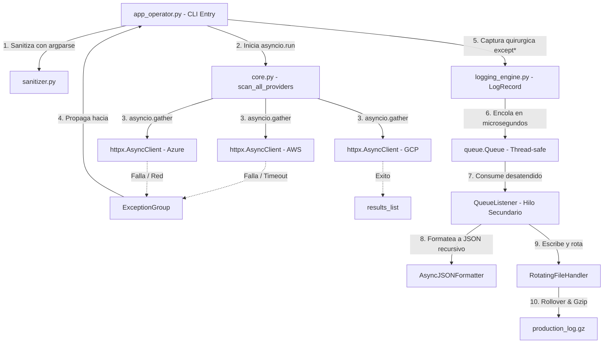

# Proyecto Triton - Telemetria Multicloud

## Grupo: Runtime Error 💀

## Integrantes

| Nombre                     |
| -------------------------- |
| Alegre, Facundo Sebastian  |
| Gaspar, Lautaro            |
| Herrera, Nancy Mariel      |
| Mamani, Hector Mauricio    |
| Rodriguez, Hector Fernando |
| Maldonado, Fernando        |

## Roles del Proyecto

| #   | Rol                                            | Archivo(s)                        | Integrante                 |
| --- | ---------------------------------------------- | --------------------------------- | -------------------------- |
| 1   | Robustez de Entradas y Excepciones             | `exceptions.py` + `sanitizer.py`  | Herrera, Nancy Mariel      |
| 2   | Concurrencia y Telemetria Asincrona            | `core.py`                         | Maldonado, Fernando        |
| 3   | Formateo Estructurado JSON                     | `logging_engine.py` (formatter)   | Mamani, Hector Mauricio    |
| 4   | Almacenamiento y Desacoplamiento No Bloqueante | `logging_engine.py` (pipeline)    | Alegre, Facundo Sebastian  |
| 5   | Integracion y Flujo CLI                        | `app_operator.py` + `__init__.py` | Rodriguez, Hector Fernando |
| 6   | Simulacion de Caos y Pruebas Forenses          | `tests/`                          | Gaspar, Lautaro            |

## Requisitos

- Python 3.11+
- httpx>=0.27.0

## Instalacion

```bash
git clone https://github.com/Ferco7/triton_monitor.git
cd triton_monitor
pip install -r requirements.txt
```

## Ejecucion

```bash
python3 src/app_operator.py AWS GCP -c cluster-us-east-01 -t 3.0
```

## Diagrama de Arquitectura



## Estructura del Proyecto

```
triton_monitor/
├── src/
│   ├── triton_telemetry/
│   │   ├── __init__.py          # API publica del paquete
│   │   ├── exceptions.py        # Excepciones semanticas custom
│   │   ├── sanitizer.py         # Validacion de argumentos CLI
│   │   ├── core.py              # Logica asincrona de red
│   │   └── logging_engine.py    # Formateador JSON y pipeline
│   └── app_operator.py          # Punto de entrada CLI
├── tests/
│   ├── README.md                # Instrucciones para tests
│   └── test_scenarios.py        # Escenarios de validacion
├── requirements.txt             # Dependencias del proyecto
├── .gitignore                   # Archivos ignorados por git
└── README.md                    # Este archivo
```
